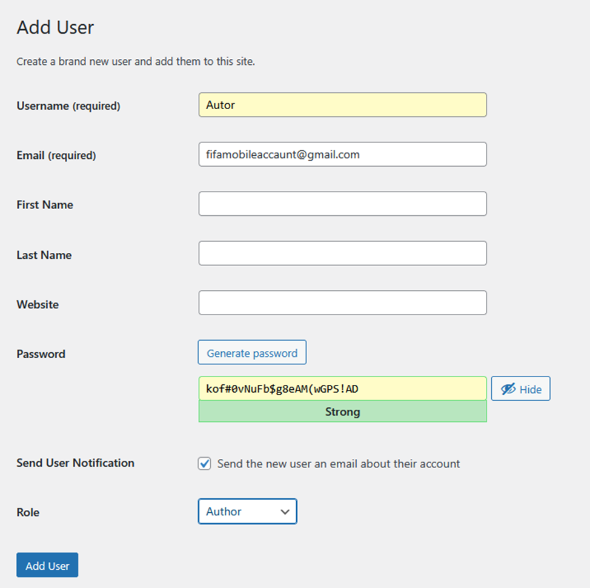

# Raport: Lucrarea de laborator nr. 5. Securitatea WordPress

## Scopul lucrării

Securizarea unei instalări WordPress clasice prin gestionarea rolurilor, hardening, monitorizare și configurarea pluginurilor All In One WP Security & Firewall (AIOS) și UpdraftPlus pentru backup.

---

## Partea I: Desfășurarea lucrării (Pas cu Pas)

### Pasul 1. Pregătirea mediului de lucru

Am activat modul de depanare adăugând define('WP_DEBUG', true); în fișierul wp-config.php pentru a vizualiza eventualele conflicte de securitat

```php
define('WP_DEBUG', true);
```

Această setare ne asigură vizibilitate maximă în cazul apariției conflictelor de securitate.


### Pasul 2. Gestionarea rolurilor și politicilor de parole stricte

Am navigat în panoul de administrare la secțiunea **Users (Utilizatori) -> Add New (Adaugă utilizator nou)**. Cu scopul de a izola activitățile cu impact general pe site și a nu le comasa exclusiv sub puterea super-admin-ului, am generat un utilizator adițional limitat, dotat cu rolul de **Autor**. Acest cont este dedicat publicării unice de conținut curat și nu va avea nicio interfață privind adăugarea setărilor nucleare ori instalarea plugin-urilor.  



Confirmarea completă a înregistrării s-a materializat odată ce acest utlizator Autor a fost generat și a apărut prezentat distinct în lista unificată de administrare. 


### Pasul 3. Mentenanța și actualizările sistemului (Core, Teme și Pluginuri)

Accesând meniul structurat sub elementul **Dashboard -> Updates (Panou de control -> Actualizări)** m-am asigurat, direct din sursele oficiale, că instalarea curentă utilizează în mod activ ultima versiune stabilă a pachetului WordPress Core. Totodată, verificările au asimilitat faptul că orice temă adițională prestabilită (ex. Twenty Twenty-Four, sau teme clasice incluse automat) și eventualele componente plugin erau strict „Up to date”.


### Pasul 4. Hardening de bază (Restricționarea editării și limitarea accesului web server)

Dezactivarea editorului de teme: Am adăugat define('DISALLOW_FILE_EDIT', true); în wp-config.php pentru a preveni injectarea de cod (RCE) direct din interfața de administrare.

```php
define('DISALLOW_FILE_EDIT', true);
```

Protejarea fișierelor sensibile: Am blocat accesul extern la wp-config.php adăugând următoarele reguli în fișierul .htaccess:

```apache
<files wp-config.php>
   order allow,deny
   deny from all
</files>
```


### Pasul 5. Instalarea și configurarea avansată folosind modulul All In One WP Security & Firewall (AIOS)

Peste blocarea manuală primară am considerat critic necesar extinderea măsurilor superioare care necesită monitorizare vizuală complexă bazată pe detecție automată, operare asimilată de instrumente centralizate de audit WAF (Web Application Firewall). Drept urmare, a fost instalată și declarată activă platforma superioară **All In One WP Security & Firewall (AIOS)**. Interfața inițială integrată aduce undă verde ce confirmă procedeele fundamentale ce puseseră stăpânire de acțiune protejând mediul pre-operațional în fundal.


Pentru o rată solidă de acoperire care să depășească gradul mediocru de atac, am rearanjat și manipulat o listă stufoasă de opțiuni din configurația plugin-ului, conform practicilor următoare:

#### A. Manipularea conturilor de utilizatori vulnerabile (Renamed Admin - module User Accounts)

Am schimbat numele contului implicit din „admin” în admin132.


#### B. Restricția procesului de înregistrare automată (Manual Approval Registration - Spam Control)

Am setat aprobarea manuală a conturilor noi pentru a bloca spammerii


#### C. Politici anti-Brute-Force și rate limitare IP (Login Lockdown Module)

Am limitat tentativele de autentificare: blocare IP de 30 de minute după 5 eșecuri într-un interval de 15 minute.


#### D. Extragerea sesiunilor paralele latente expuse prin deconectare automată (Force Logout Control)

Am impus deconectarea automată (Force Logout) a tuturor utilizatorilor la fiecare 24 de ore (1440 minute).


#### E. Schimbarea topologiei endpoint-urilor (Mascarada via Rename Login Page Module)

Am redenumit pagina implicită wp-login.php în /login-securizat.


#### F. Inspecțiile strat-bază POSIX ce acoperă nivelele OS fizice instalate (Filesystem Structure / Permissions)

Am verificat ca folderele să aibă permisiuni 755, iar fișierele 644


#### G. Integrarea ierarhiilor prin Firewall Web App și Politici HTTP speciale


Am limitat upload-ul la 100MB, am blocat interogările HTTP periculoase (XSS/SQLi) și am activat filtrarea avansată a șirurilor de caractere.


Asigurând elementele mai nuanțate din aceeași stivă, sub **String filtering** a fost impus să se declanșează obligativitatea regulii **"Enable advanced character string filter"**. Extinderea funcționează ca senzor special care anulează, ca o politică aspră specifică, semnătura și ansamblul secvențial a seturilor pe litere asimilitate metodelor complicate de evadări specifice pattern-urilor asimilate la testele malițioase (XSS Strings Patterns inserate des prin manipulare pe mesaje formulare).


#### H. Auditări avansate pentru schimbările coruptibile invizibile direct (Scanner Malware) & Alertele Email 
Platforma nu a omis uneltele automatizate asincrone a căror procedură necesită raportarea integrității prin monitorizare. A fost declanșat prin File security / *Files change detection settings*, procesorul de cron-scanning programat ce evaluează constant starea inițială generală. Măsura compară hashurile a ce fișiere erau anterenior stocate și a fost instigat să ruleze scanul integrat și să acționeze sistematic evaluarea o dată la "4 săptămâni". În acest fel aflăm din timp la coruperea unui fișier sub o atacator masivă fără prezența alterăriilor vizibilă a formei web (Backdoor de server rootkits stealthy).  


Aproape final a adus notificarea promptă vizuală – nu era permis lăsarea incidentului de izolare netrasmis a elementului de urgență. Reglementarea **Notifications alert settings (Notify by email)** a obligat serverul la o alertare direct pe in-box-ul cu o sursă pre-asigurată dedicat profilului admnistrator (așa cum am indicat via formular e-mail) a incidentelor care dovedesc cum și cine este atacat exact când cineva a atins Lockout rate max fail attempts pe firewallul de Brute Force per sesiune din dashboard loging limitări proceduri.


### Pasul 6. Sistem Garantat Defensiv folosind Extensii Backup periodice (UpdraftPlus Module Settings)

Am configurat backup-uri automate lunare pentru Baza de Date, cu o retenție de 2 arhive.


Am efectuat un backup manual complet și am descărcat arhivele local (offline), pregătite pentru Disaster Recovery.


Rapoartele finale au ridicat asistența completă prin manevrarea arhivelor logice DB selectate individual cu suport complet descărcabile local pentru extragerea acestora prin funcția *Download to your computer*. Componentă care oferă acuratețe garanției unei rețete offline salvate izolat ca transfer arhive date direct referențiate zip. Gata garantat direct a o prelua la nevoie Disaster recovery spre transfer curățat (Offsite-cloud remote-system host backup), o decizie care blindează structurile a nu a sta centralizate strict pe discul ce funcționează instanța curentă. S-a realizat extragerea arhivei pure g-zip offline.


### Pasul 7. Etapa Supremă de Certificări prin scenarii de validare (Test Blocking Brute-Force limit și Verificarea Datelor Restabile via Restore procedure)

Dovada existenței sistemulilor asigurate necesită certitudini obținute exclusiv testării negative (simularea ca penetration testing din unghiul vizat adversar negativ atacator) pe ambele brațe asimilate ca element de limită activ și validare garanție funcțională la moment post-avarie irrecuperabile date umane gresite accidental ștergere. 

**Exercițiul A. Test de izolare restrictivă prin agresiune IP blocat (Rate-Limiting firewall trigger):**

Am introdus intenționat parole greșite de 6 ori pe pagina /login-securizat. Rezultat: IP-ul meu a fost blocat instantaneu, iar incidentul a fost înregistrat corect în logurile AIOS.

 


**Exercițiul B. Procedură extremă de recuperare și readucerea consistenței stării (Avarii provocate intern / Ștergere a articolelor referințele Post Content Destroy Test via Undo Backup Recovery):**  

Am șters intenționat un articol (inclusiv din Trash). Rezultat: Am folosit arhiva de backup din UpdraftPlus pentru a restaura baza de date, iar articolul a reapărut intact pe site.


 


Fără probleme aplicația UpdraftPlus sub instigare rulându-se a finalizat corelat preluarea pe pchetele arhivă proces subloc structură DB tabelară din backup preștergere rescriind direct complet. 


Validăm vizual! Executand o procedură reîmprospătare generală, prelucrând întoarcerea de proces, si revenind navigativ direct sub interfață panoul la zona gestionată - **Posts (Articole publice) panou**. Reușită!


---

## Partea a II-a: Răspunsuri la întrebările de control

**1. De ce DISALLOW_FILE_EDIT și permisiunile corecte pe wp-config.php reduc semnificativ riscul post-exploit?**  

DISALLOW_FILE_EDIT previne atacatorii care au compromis un cont de admin să injecteze cod PHP malițios (backdoors/shells) direct din editorul vizual WordPress.

Securizarea wp-config.php (prin permisiuni de citire restrânse și .htaccess) previne furtul credențialelor bazei de date și a cheilor criptografice (salts), blocând compromiterea totală a infrastructurii.

**2. Ce setări ai ales pentru Login Lockdown/Firewall și de ce (explică echilibrul între securitate și experiența utilizatorului)?**  

Am ales blocarea IP-ului timp de 30 de minute după 5 încercări eșuate în 15 minute. Această configurație oprește eficient atacurile automate de tip brute-force lansate de boți, dar este suficient de permisivă pentru a nu bloca permanent un utilizator legitim care doar și-a tastat greșit parola de câteva ori.

**3. Cu ce se deosebesc măsurile de protecție la nivel WordPress (plugin/WAF) față de cele la nivelul serverului web și al sistemului de operare?**  

Nivel WordPress (WAF/Layer 7): Acționează la nivelul aplicației. Înțelege contextul (utilizatori, permisiuni, payload-uri SQLi/XSS) și poate bloca comportamente malițioase specifice (ex. comentarii spam, url-uri ascunse).

Nivel Server/OS (Layer 3/4): Acționează brut, la nivel de rețea (ex. IPtables, limitări porturi TCP). Nu înțelege logica WordPress, dar este excelent pentru a bloca pachete malițioase înainte să consume resursele serverului (ex. mitigarea atacurilor DDoS).

**4. Ce trebuie inclus neapărat într-un backup „complet” WordPress și cum verifici dacă restaurarea funcționează cu adevărat?**  

Un backup complet necesită două componente obligatorii: Baza de date (structura SQL, postări, setări) și Fișierele aplicației (folderele wp-content/, teme, pluginuri, fișiere media din uploads/, și fișierele de configurare precum wp-config.php).

Verificarea nu se face doar uitându-te la dimensiunea arhivei. Confirmarea sigură se face doar printr-un test de restaurare (Dry Run/Staging): instalarea arhivei pe un mediu de test izolat și verificarea manuală a funcționalității (linkuri valide, imagini afișate corect, lipsa erorilor 404).
